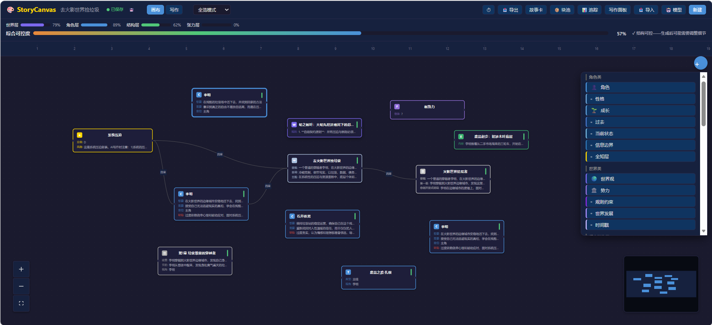
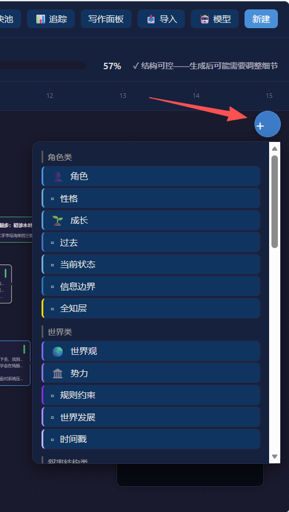
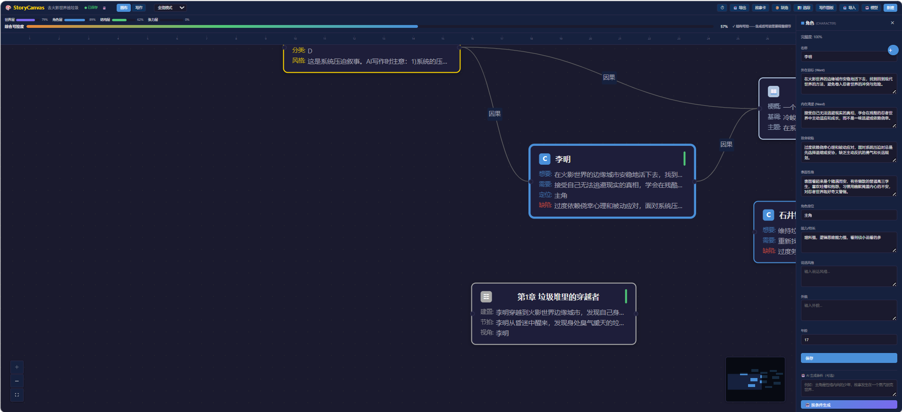
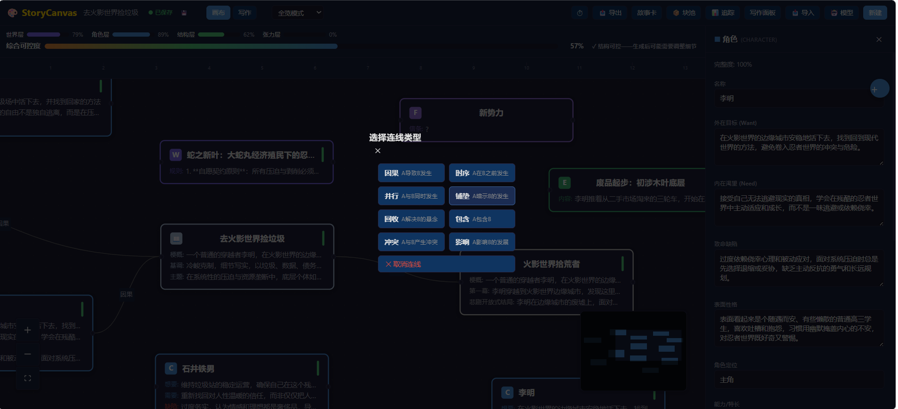
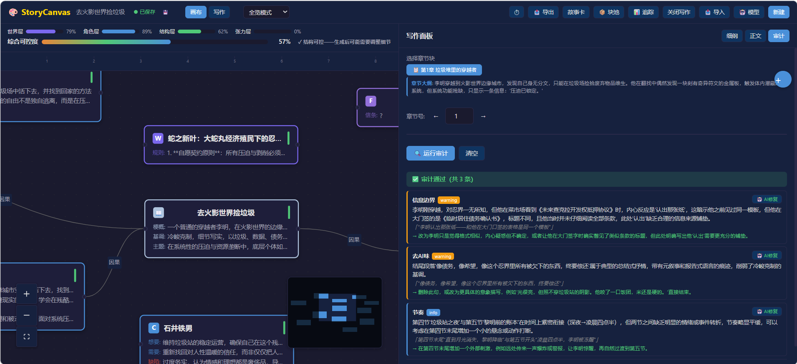
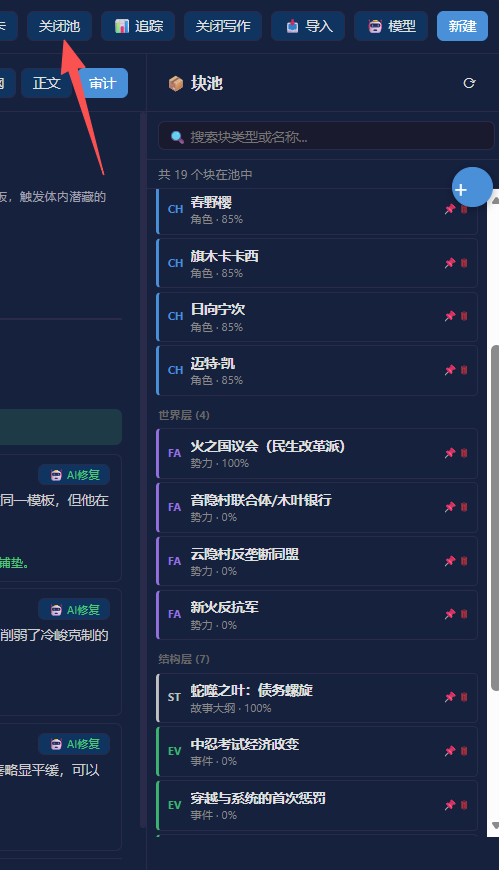
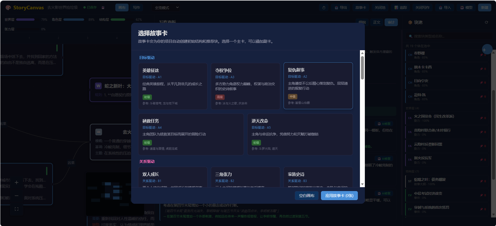
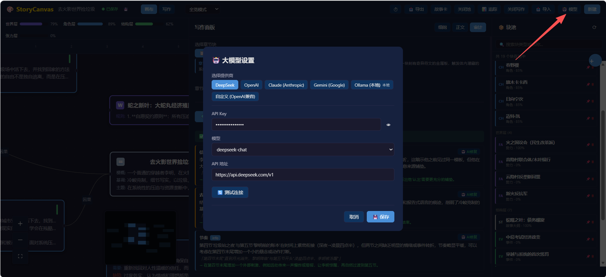

# 🎨 StoryCanvas — 自由画布叙事创作系统

> **在画布上摆放、连接、组织叙事元素，AI 协助你将结构转化为高质量正文。**  
> 适用范围：小说 · 剧本 · 史诗级世界构建  
> 对标创作体量：魔兽世界 · 冰与火之歌 · 从零开始的异世界生活

---

## 界面预览

> 📸 **截图指南**：以下为预留的截图位置，请按说明截图后替换图片路径。

### 1. 画布编辑器——核心工作区


*画布编辑器全貌：左侧画布摆放叙事块，顶部进度条展示四维度完整度，底部章节刻度尺供场景吸附*

### 2. 添加块菜单


*点击右上角「+」按钮弹出分组菜单，33种块类型按角色/世界/结构/关系等类别排列*

### 3. 块编辑与AI生成


*点击任意块打开右侧编辑器，填写字段或点击「🤖 按条件生成」让AI自动填充，支持写入生成条件*

### 4. 连线操作


*从一个块拖线到另一个块后，弹出8种连线类型选择（因果/时序/并行/铺垫/回收/包含/冲突/影响）*

### 5. 写作面板与审计


*写作面板选择章节大纲块，生成细纲/正文，审计模式展示12维度结构化问题清单*

### 6. 块池管理


*块池存放不在画布上的块，可按类别筛选和搜索，点击「📌」放回画布*

### 7. 故事卡选择


*创建项目时弹出35张故事卡选择器，选主卡+叠加副卡自动搭建初始画布结构*

### 8. 大模型配置


*支持DeepSeek/OpenAI/Claude/Gemini/Ollama/自定义6种提供商，一键测试连接*

---

## 目录

- [操作方法（用户指南）](#操作方法用户指南)
- [项目概述](#项目概述)
- [系统架构](#系统架构)
- [技术栈](#技术栈)
- [后端结构](#后端结构)
- [前端结构](#前端结构)
- [数据库表结构](#数据库表结构)
- [API 端点完整列表](#api-端点完整列表)
- [LLM 提供商](#llm-提供商)
- [块类型（35 种）](#块类型35-种)
- [故事卡体系（11 张）](#故事卡体系11-张)
- [五层 Agent 写作管线](#五层-agent-写作管线)
- [三层保存机制](#三层保存机制)
- [导出与导入](#导出与导入)
- [风格签名系统](#风格签名系统)
- [配置说明](#配置说明)
- [快速开始](#快速开始)
- [项目结构总览](#项目结构总览)

---

## 操作方法（用户指南）

### 🚀 快速上手

```
创建项目 → 选故事卡 → 加块/连线 → 设置模型 → 生成正文
```

### 1. 创建项目

| 步骤 | 操作 |
|------|------|
| ① | 打开 `http://localhost:5173`，点击 **「新建项目」** |
| ② | 输入项目名称和类型（如：奇幻、科幻、悬疑） |
| ③ | 创建后弹出 **故事卡选择器**，选一张主卡开始 |

> 如果跳过故事卡，之后随时可点击顶部 **「故事卡」** 按钮重新选择。

### 2. 添加块

点击画布右上角的 **"+"** 按钮，展开分组菜单：

| 分组 | 包含的块类型 |
|------|-------------|
| **角色类** | 角色、性格、成长弧线、过去、当前状态、信息边界、全知层 |
| **世界类** | 世界观、势力、规则约束、世界发展、时间戳 |
| **叙事结构类** | 时间线、场景、事件、目标、冲突、转折点、悬念、铺垫、意外 |
| **关系类** | 角色关系、势力关系 |
| **表达类** | 意境、情绪目标、节奏、主题陈述、镜头 |
| **剧本类** | 场景头、动作行、对白、视觉主题 |
| **特殊类** | 读者情绪曲线 |

点击一个块类型后，块会出现在画布上。点击块可打开右侧编辑器填写字段。

### 3. 连线

从一个块的右侧拖拽到另一个块的左侧，松开后弹出**连线类型选择框**：

| 连线类型 | 含义 | 颜色 |
|----------|------|------|
| 因果 | A 导致 B 发生 | `#666` 灰色 |
| 时序 | A 在 B 之前发生 | `#999` 浅灰 |
| 并行 | A 与 B 同时发生 | `#4A90D9` 蓝色 |
| 铺垫 | A 暗示 B 的发生 | `#F39C12` 橙色（动画） |
| 回收 | A 解决 B 的悬念 | `#50C878` 绿色 |
| 包含 | A 包含 B | `#333` 深灰 |
| 冲突 | A 与 B 产生冲突 | `#E74C3C` 红色 |
| 影响 | A 影响 B 的发展 | `#9370DB` 紫色 |

**连线示例**：角色 → 目标（因果线）、角色 → 冲突（冲突线）、悬念 → 场景（铺垫线）

### 4. 编辑块

点击任意块，右侧打开编辑器面板。不同块类型显示不同字段：

- **角色块**：名称、外在目标、内在渴望、致命缺陷、性格、外貌等
- **场景块**：标题、场景目标、情绪目标、张力级别、场景内容等
- **世界观块**：世界名称、核心规则、宇宙结构、力量体系等
- 其他块类型都配有专用字段，部分字段带下拉选择

编辑后自动保存，块左上角的完整度指示器（绿/黄/红）实时更新。

### 5. 视图模式

顶部下拉切换画布显示模式：

| 模式 | 显示内容 |
|------|---------|
| **全览模式** | 所有块和连线 |
| **角色聚焦** | 只显示角色类块（角色/性格/成长/过去/状态/信息边界/关系） |
| **时间线模式** | 只显示时间线/场景/事件等时序块 |
| **伏笔追踪** | 只显示悬念/铺垫/意外等伏笔块 |
| **进度模式** | 全览 + 进度条高亮 |
| **剧本模式** | 只显示剧本类块（场景头/动作行/对白/视觉主题） |

### 6. 大模型设置

点击顶部 **「🤖 模型」** 按钮，配置 AI 写作引擎：

| 提供商 | 说明 | 配置项 |
|--------|------|--------|
| **DeepSeek** | 国内可用，性价比高 | API Key、模型选择 |
| **OpenAI** | GPT 系列模型 | API Key、模型、API 地址 |
| **Claude** | Anthropic 系列 | API Key、模型、API 地址 |
| **Gemini** | Google 系列 | API Key、模型 |
| **Ollama** | 本地运行，免费 | 服务地址、模型（可刷新本地列表） |
| **自定义** | 任意 OpenAI 兼容 API | API 地址、API Key、模型名 |

支持**一键测试连接**，确认配置无误。

### 7. 生成正文

点击顶部 **「写作面板」** 按钮：

1. **选择章节** — 从章节列表中选择要生成的章节
2. **生成细纲** — AI 根据画布块生成章节大纲
3. **生成正文** — SSE 流式输出完整章节
4. **可选指令** — 可填写额外写作指令

> 生成前可以在画布中完善相关块的字段，完整度越高生成质量越好。

### 8. 进度与追踪

**进度条**（画布顶部）：
- 四维度：世界层 / 角色层 / 结构层 / 张力层
- 综合可控度 + 质量描述（如"推敲中" → "可发表"）

**叙事追踪**（点击 **「📊 追踪」**）：
- **铺垫追踪** — 哪些悬念/铺垫设置了还没回收
- **角色弧线** — 每个角色的成长弧线状态
- **关系网络** — 角色间的各种关系
- **时间线** — 多线叙事的时间线视图
- **信息边界** — 检测角色是否知道了不该知道的信息

### 9. 保存与快照

| 层级 | 方式 | 说明 |
|------|------|------|
| L1 实时保存 | 自动 | 每次编辑立即写库，绿点状态 |
| L2 自动快照 | 每 15 分钟 | 后台自动创建，保留最近 20 个 |
| L3 检查点 | 手动 | 点击 ⏱ 按钮创建里程碑快照 |

### 10. 导出与导入

**导出**（点击 **「📤 导出」**）：
- `.storycanvas` — 完整项目备份（含所有数据）
- `canvas.json` — 仅画布结构
- `Markdown` — 全书文本

**导入**：
- 拖拽 `.storycanvas` / `canvas.json` / `PNG` 文件到画布
- 或点击「📤 导出」→ 选择文件导入
- 导入前会弹出预览确认框

### 💡 创作建议

```
新手：选故事卡 → 添加角色和场景 → 简单连线 → 生成看看
进阶：自由搭建画布 → 完善各块字段 → 多轮生成迭代
专家：全自定义 → 精细控制每层 → 配合审计修订
```

StoryCanvas 是一个以**自由画布**为核心的 AI 辅助叙事创作系统。它不是线性写作工具，而是一个空间化的故事构建环境——作者在画布上摆放、连接、组织叙事元素，系统负责将结构转化为 AI 可理解的写作上下文，最终生成高质量正文。

### 核心设计哲学

| 原则 | 说明 |
|------|------|
| **脚手架渐进拆除** | 小白看到引导，资深作家看到自由度，同一套系统自动适配 |
| **块独立性** | 每个块携带自己的状态，不依赖其他块存在 |
| **永远可以生成** | 进度条是质量预测器，不是门槛——哪怕只有一个块也能生成 |
| **画布是导演台** | 用户做导演决策，AI 做执行工作 |
| **世界状态分层** | 全知层（作者）/ 角色层 / 读者层，三层独立维护 |

---

## 系统架构

```
┌─────────────────────────────────────────────────────────────────────┐
│                       画布层  Canvas Layer                           │
│   React Flow 画布 · 35 种块渲染 · 8 种连线管理 · 故事卡展开        │
├─────────────────────────────────────────────────────────────────────┤
│                       状态层  State Layer                            │
│   Zustand Store · 画布节点/边状态 · 项目数据 · UI 状态 · 进度计算  │
├─────────────────────────────────────────────────────────────────────┤
│                       API 层  API Layer                              │
│   FastAPI · 项目 CRUD · 块 CRUD · 连线管理 · 生成触发 · 快照管理   │
│   导出/导入 · 设置管理 · 连接测试                                    │
├─────────────────────────────────────────────────────────────────────┤
│                     叙事引擎层  Narrative Engine                      │
│   上下文聚合器 · 块转译器 · 细纲生成器 · 一致性检测 · 风格签名系统  │
├─────────────────────────────────────────────────────────────────────┤
│                       写作管线层  Pipeline                            │
│   建筑师Agent → 写手Agent → 验证器 → 审计员Agent → 修订者Agent      │
│                                                                     │
│                       回写器  Writeback                              │
│   将结算表结果写回画布：更新角色状态/伏笔/关系/世界快照              │
├─────────────────────────────────────────────────────────────────────┤
│                       LLM 抽象层                                     │
│   DeepSeek · OpenAI · Claude · Gemini · Ollama · 自定义兼容         │
└─────────────────────────────────────────────────────────────────────┘
```

### 数据流向

```
画布块数据 (JSON)
    │
    ├─→ 渲染层：React Flow 节点/边渲染
    │
    ├─→ 持久层：SQLite (projects/blocks/connections/chapters/canvas_layout/snapshots)
    │
    └─→ 上下文聚合器 (ContextAggregator):
            ↓
         按章节收集相关块
            ↓
         to_context() 结构化输出
            ↓
         注入写作提示词（含风格签名）
            ↓
         Agent 管线生成（建筑师→写手→验证器→审计员→修订者）
            ↓
         结果回写 → 更新块状态（回写器）
```

---

## 技术栈

| 层级 | 技术选型 | 版本 |
|------|----------|------|
| 画布引擎 | React Flow | ^11.11.3 |
| 前端框架 | React + TypeScript | ^18.3.1 |
| 状态管理 | Zustand + Immer | ^4.5.4 |
| 构建工具 | Vite | ^5.4.2 |
| 后端框架 | FastAPI (Python) | ≥0.100.0 |
| 数据库 | SQLite (WAL 模式) | - |
| AI 协议 | OpenAI 兼容 / Anthropic / Google Gemini / Ollama | - |
| 流式响应 | SSE (Server-Sent Events) via sse-starlette | - |
| HTTP 客户端 | httpx (异步) | ≥0.25.0 |

---

## 后端结构

### 目录树

```
backend/
├── main.py                          # FastAPI 应用入口，路由注册，健康检查
├── requirements.txt                 # Python 依赖
│
├── core/                            # 核心模块
│   ├── config.py                    # 配置加载（.env + llm_settings.json）
│   ├── database.py                  # SQLite 连接管理，6 张表的 DDL
│   ├── models.py                    # Pydantic 请求/响应模型
│   └── snapshot.py                  # 快照引擎（自动/检查点/回滚/清理/完整性检查）
│
├── api/                             # RESTful API 路由
│   ├── projects.py                  # 项目 CRUD + 进度查询 + 应用故事卡
│   ├── blocks.py                    # 块 CRUD + 批量创建/移动
│   ├── connections.py               # 连线 CRUD + AI 建议连线
│   ├── canvas.py                    # 画布布局查询/保存
│   ├── generate.py                  # SSE 流式生成（细纲/正文/块内容）
│   ├── export_import.py             # .storycanvas 导出/导入 + canvas.json + Markdown
│   └── snapshots_api.py             # 快照管理（列表/创建/回滚/删除/完整性检查）
│
├── narrative/                       # 叙事引擎
│   ├── aggregator.py                # 上下文聚合器（按章节收集块）
│   ├── translator.py                # 块 → 提示词转译 + 风格签名注入
│   ├── progress.py                  # 完整度计算 + 分类进度条
│   └── validator.py                 # 信息边界检测（零 LLM 规则）
│
├── pipeline/                        # 写作管线（五层 Agent）
│   ├── architect.py                 # 建筑师 Agent
│   ├── writer.py                    # 写手 Agent（流式）
│   ├── auditor.py                   # 审计员 Agent
│   ├── revisor.py                   # 修订者 Agent
│   └── writeback.py                 # 结算回写器
│
├── llm/                             # LLM 抽象层
│   ├── base.py                      # BaseLLM 抽象基类 + create_llm() 工厂
│   ├── openai_compat.py             # OpenAI 兼容协议（DeepSeek / OpenAI / 自定义）
│   ├── claude.py                    # Anthropic Claude API
│   ├── gemini.py                    # Google Gemini API
│   ├── ollama.py                    # Ollama 本地模型
│   └── deepseek.py                  # (旧版，已由 openai_compat 替代)
│
├── story_cards/                     # 故事卡系统
│   ├── cards.json                   # 35 张故事卡定义（A-G 全类别）
│   └── cards.py                     # 故事卡加载器
│
└── data/                            # 运行时数据
    ├── storycanvas.db               # SQLite 数据库文件
    └── llm_settings.json            # LLM 设置持久化（通过 Web UI 保存）
```

### 核心模块说明

#### `config.py`
- 从 `.env` 文件加载默认配置
- 从 `data/llm_settings.json` 加载 Web UI 保存的运行时配置（优先级高于 `.env`）
- 提供 `Settings` 单例，支持 6 种 LLM 提供商的配置属性
- `get_settings_dict()` / `update_settings()` 供 API 读写

#### `database.py`
- 6 张表：`projects`, `blocks`, `connections`, `chapters`, `canvas_layout`, `snapshots`
- WAL 模式 + 外键约束
- `_migrate_add_column()` 安全迁移新增字段

#### `snapshot.py`
- 自动快照每 15 分钟触发（保留最近 20 个）
- 检查点由用户手动创建（永久保留）
- 回滚时自动创建"回滚前备份"快照
- 完整写入：所有块 + 连线 + 布局 + 章节

---

## 前端结构

### 目录树

```
frontend/
├── index.html                       # HTML 入口
├── package.json                     # npm 依赖
├── tsconfig.json                    # TypeScript 配置
├── vite.config.ts                   # Vite 配置（含 API 代理到 :8767）
│
└── src/
    ├── main.tsx                     # React 入口
    ├── App.tsx                      # 主组件（路由/状态/布局/导入导出/拖拽）
    │
    ├── store/                       # Zustand 状态管理
    │   ├── canvasStore.ts           # 画布状态（nodes/edges/viewport/viewMode）
    │   ├── projectStore.ts          # 项目数据（CRUD API 封装）
    │   └── uiStore.ts               # UI 状态（面板/弹窗/Toast）
    │
    ├── api/                         # API 调用层
    │   ├── blocks.ts                # 项目/块/连线/画布布局/进度/故事卡 API
    │   ├── generate.ts              # SSE 流式生成客户端
    │   ├── settings.ts              # LLM 设置 API
    │   ├── snapshots.ts             # 快照管理 API
    │   └── export_import.ts         # 导出/导入 API
    │
    ├── types/                       # TypeScript 类型定义
    │   ├── blocks.ts                # 35 种块类型 + 8 种连线类型 + 颜色映射
    │   └── canvas.ts                # 视图模式 + 故事卡 + 进度数据
    │
    ├── canvas/                      # 画布核心
    │   ├── CanvasView.tsx           # 主画布组件（React Flow + 进度条 + 章节轴）
    │   ├── nodes/                   # 块渲染组件
    │   │   ├── BaseBlock.tsx        # 通用块（35 种类型通用渲染）
    │   │   ├── CharacterBlock.tsx   # 角色块（含 want/need/fatal_flaw）
    │   │   ├── SceneBlock.tsx       # 场景块（含张力条/情绪目标）
    │   │   └── index.ts             # 节点类型导出
    │   └── overlays/
    │       └── ProgressBar.tsx      # 四维度进度条组件
    │
    ├── panels/                      # 侧边面板
    │   ├── BlockEditor.tsx          # 块编辑器（按类型动态展示编辑字段）
    │   ├── StoryCardPicker.tsx      # 故事卡选择器（分类展示 + 主卡/副卡叠加）
    │   ├── WritingPanel.tsx         # 写作面板（细纲/正文生成 + SSE 流式输出）
    │   ├── LLMSettingsModal.tsx     # 大模型设置（6 种提供商配置）
    │   └── SnapshotHistoryPanel.tsx # 快照历史面板（检查点/自动快照/回滚/删除）
    │
    └── styles/
        └── index.css                # 全局样式（深色主题）
```

### 核心组件说明

#### `App.tsx`
- **状态管理**：项目选择、创建、导出、导入拖放等全局操作
- **头部**：Logo、项目名、保存状态指示器（绿/黄/红点）、标签页切换（画布/写作）、视图模式选择、操作按钮（导出/故事卡/写作/模型/新建）
- **布局**：画布或写作面板居主体，块编辑器/写作面板/历史面板居右
- **拖拽导入**：监听 `dragover/drop` 事件，检测 `.storycanvas` / `.json` / `.png` 文件
- **导入对话框**：先预览（显示块数/章节数/字数），确认后导入

#### `CanvasView.tsx`
- React Flow 画布（`<ReactFlow>`），深色主题
- 顶部进度条（四维度：世界层/角色层/结构层/张力层 + 综合可控度）
- 章节刻度尺（画布顶部固定区域，每 100px = 1 章）
- 节点点击 → 打开右侧块编辑器面板
- 画布空白点击 → 关闭编辑器

#### `canvasStore.ts`
- 与 React Flow 深度绑定：`applyNodeChanges` / `applyEdgeChanges`
- `syncFromBlocks(blocks, connections)`：将后端数据同步为 React Flow 的 Nodes/Edges
- 管理视图模式（全览/角色聚焦/时间线/伏笔追踪/进度）

---

## 数据库表结构

### 6 张表

#### `projects`
| 字段 | 类型 | 说明 |
|------|------|------|
| id | TEXT PK | UUID |
| title | TEXT NOT NULL | 项目名称 |
| genre | TEXT | 类型标签 |
| story_cards | TEXT | JSON: 选用的故事卡 ID 列表 |
| style_sig | TEXT | JSON: 风格签名 |
| omniscient | TEXT | JSON: 全知层内容 |
| settings | TEXT | JSON: 其他设置 |
| experience_flags | TEXT | JSON: 用户熟练度标记 |
| chapter_count | INTEGER | 总章节数（默认 30） |
| **last_snapshot_at** | TEXT | 最后一次自动快照时间 |
| **import_source** | TEXT | 如果是导入的，记录来源 |
| created_at | TEXT | 创建时间 |
| updated_at | TEXT | 更新时间 |

#### `blocks`
| 字段 | 类型 | 说明 |
|------|------|------|
| id | TEXT PK | UUID |
| project_id | TEXT FK | 所属项目 |
| type | TEXT NOT NULL | 块类型（35 种枚举） |
| canvas_x / canvas_y | REAL | 画布位置 |
| canvas_w | REAL | 块宽度（默认 280） |
| collapsed | INTEGER | 折叠状态 |
| color | TEXT | 覆盖默认颜色 |
| timeline_id | TEXT | 所属时间线 |
| chapter_pos | TEXT | 时间轴锚点（如 `chapter_5`） |
| completeness | REAL | 完整度 0.0~1.0 |
| tags | TEXT | JSON 数组 |
| notes | TEXT | 作者私有备注 |
| content | TEXT NOT NULL | JSON: 块具体内容（按类型不同） |
| is_draft | INTEGER | 草稿标志 |
| **save_status** | TEXT | saved/saving/failed |
| created_at / updated_at | TEXT | 时间戳 |

#### `connections`
| 字段 | 类型 | 说明 |
|------|------|------|
| id | TEXT PK | UUID |
| project_id | TEXT FK | 所属项目 |
| from_block | TEXT FK | 源块 ID |
| to_block | TEXT FK | 目标块 ID |
| conn_type | TEXT NOT NULL | 连线类型（8 种） |
| label | TEXT | 可选文字标注 |
| chapter_hint | TEXT | 关联章节提示 |
| created_at | TEXT | 创建时间 |

**conn_type 枚举**：`causes`(因果) · `follows`(时序) · `parallels`(并行) · `foreshadows`(铺垫) · `resolves`(回收) · `contains`(包含) · `conflicts`(冲突) · `influences`(影响)

#### `chapters`
| 字段 | 类型 | 说明 |
|------|------|------|
| id | TEXT PK | UUID |
| project_id | TEXT FK | 所属项目 |
| chapter_num | INTEGER NOT NULL | 章节号 |
| title | TEXT | 章节标题 |
| timeline_id | TEXT | 所属时间线 |
| outline | TEXT | AI 生成的细纲 |
| content | TEXT | 正文 |
| audit_result | TEXT | JSON: 审计结果 |
| status | TEXT | planned/outlined/generated/approved/imported |
| word_count | INTEGER | 字数 |
| block_refs | TEXT | JSON: 生成时使用的块 ID 列表 |
| **special_links** | TEXT | JSON: 细纲特殊关联线 |
| created_at / updated_at | TEXT | 时间戳 |

#### `canvas_layout`
| 字段 | 类型 | 说明 |
|------|------|------|
| project_id | TEXT PK FK | 项目 ID |
| viewport_x / viewport_y | REAL | 画布视口位置 |
| zoom | REAL | 缩放级别 |
| timeline_y | TEXT | JSON: {timeline_id: y 坐标} |
| updated_at | TEXT | 更新时间 |

#### `snapshots`
| 字段 | 类型 | 说明 |
|------|------|------|
| id | TEXT PK | UUID |
| project_id | TEXT FK | 所属项目 |
| snapshot_type | TEXT NOT NULL | "auto" 或 "checkpoint" |
| label | TEXT | 检查点用户自定义名称 |
| blocks_json | TEXT NOT NULL | 所有块完整 JSON 快照 |
| connections_json | TEXT NOT NULL | 所有连线完整 JSON |
| canvas_layout_json | TEXT | 画布视口和布局 |
| chapters_json | TEXT | 所有章节正文快照 |
| created_at | TEXT NOT NULL | 创建时间 |
| word_count | INTEGER | 快照时总字数 |
| block_count | INTEGER | 快照时块数量 |

---

## API 端点完整列表

### 系统

| 方法 | 路径 | 说明 |
|------|------|------|
| GET | `/api/health` | 健康检查 |

### 项目管理

| 方法 | 路径 | 说明 |
|------|------|------|
| GET | `/api/projects` | 项目列表 |
| POST | `/api/projects` | 创建项目 |
| GET | `/api/projects/{id}` | 项目详情（含所有块和连线） |
| PUT | `/api/projects/{id}` | 更新项目基本信息 |
| DELETE | `/api/projects/{id}` | 删除项目 |
| GET | `/api/projects/{id}/progress` | 获取进度条数据（四维度+综合） |
| POST | `/api/projects/{id}/apply-story-cards` | 应用故事卡到项目 |
| GET | `/api/projects/{id}/export` | 导出全书 Markdown（旧版） |
| GET | `/api/projects/{id}/narrative-tracking` | 叙事追踪数据（伏笔/角色弧线） |

### 故事卡

| 方法 | 路径 | 说明 |
|------|------|------|
| GET | `/api/story-cards` | 获取所有故事卡定义 |
| GET | `/api/story-cards/{id}` | 获取单张故事卡详情 |

### 块 CRUD

| 方法 | 路径 | 说明 |
|------|------|------|
| GET | `/api/projects/{id}/blocks` | 获取所有块（支持 ?type= 和 ?timeline_id= 过滤） |
| POST | `/api/projects/{id}/blocks` | 创建块 |
| GET | `/api/projects/{id}/blocks/{bid}` | 获取单个块 |
| PUT | `/api/projects/{id}/blocks/{bid}` | 更新块（自动重算完整度） |
| DELETE | `/api/projects/{id}/blocks/{bid}` | 删除块（级联删除连线） |
| POST | `/api/projects/{id}/blocks/batch` | 批量创建块 |
| PUT | `/api/projects/{id}/blocks/batch-move` | 批量移动块（框选拖拽用） |

### 连线管理

| 方法 | 路径 | 说明 |
|------|------|------|
| GET | `/api/projects/{id}/connections` | 获取所有连线 |
| POST | `/api/projects/{id}/connections` | 创建连线 |
| PUT | `/api/projects/{id}/connections/{cid}` | 更新连线 |
| DELETE | `/api/projects/{id}/connections/{cid}` | 删除连线 |
| GET | `/api/projects/{id}/connections/suggest` | AI 建议连线（启发式规则） |

### 画布布局

| 方法 | 路径 | 说明 |
|------|------|------|
| GET | `/api/projects/{id}/canvas-layout` | 获取画布布局 |
| PUT | `/api/projects/{id}/canvas-layout` | 保存画布布局 |

### AI 生成（SSE 流式）

| 方法 | 路径 | 说明 |
|------|------|------|
| POST | `/api/projects/{id}/generate/chapter-outline` | 生成章节细纲 |
| POST | `/api/projects/{id}/generate/chapter-content` | 生成章节正文（五层 Agent 管线） |
| POST | `/api/projects/{id}/generate/block-content` | AI 辅助填充块内容 |

### 快照管理

| 方法 | 路径 | 说明 |
|------|------|------|
| GET | `/api/projects/{id}/snapshots` | 获取所有快照列表（支持 ?type= 过滤） |
| POST | `/api/projects/{id}/snapshots` | 手动创建检查点 |
| POST | `/api/projects/{id}/snapshots/{sid}/restore` | 回滚到某快照 |
| DELETE | `/api/projects/{id}/snapshots/{sid}` | 删除快照 |
| GET | `/api/projects/{id}/integrity` | 检查数据库完整性 |

### 导出/导入

| 方法 | 路径 | 说明 |
|------|------|------|
| GET | `/api/projects/{id}/export/full` | 导出 .storycanvas 文件（ZIP） |
| GET | `/api/projects/{id}/export/canvas-json` | 导出 canvas.json |
| GET | `/api/projects/{id}/export/markdown` | 导出全书 Markdown |
| POST | `/api/projects/import/preview` | 导入预览（不写库） |
| POST | `/api/projects/import` | 通用导入入口 |

### 设置

| 方法 | 路径 | 说明 |
|------|------|------|
| GET | `/api/settings` | 获取系统设置（API Key 已遮蔽） |
| PUT | `/api/settings` | 更新系统设置 |
| GET | `/api/settings/ollama-models` | 获取 Ollama 本地模型列表 |
| POST | `/api/settings/test-connection` | 测试 LLM 连接 |

---

## LLM 提供商

系统支持 6 种 LLM 提供商，通过 Web UI 或 `.env` 配置。

| 提供商 | 标识符 | 实现类 | API 格式 | 配置字段 |
|--------|--------|--------|----------|----------|
| **DeepSeek** | `deepseek` | `OpenAICompatibleProvider` | OpenAI 兼容 (v1/chat/completions) | api_key, model, base_url |
| **OpenAI** | `openai` | `OpenAICompatibleProvider` | OpenAI 兼容 | api_key, model, base_url |
| **Claude** | `claude` | `ClaudeProvider` | Anthropic Messages API (v1/messages) | api_key, model, base_url |
| **Gemini** | `gemini` | `GeminiProvider` | Google streamGenerateContent | api_key, model |
| **Ollama** | `ollama` | `OllamaProvider` | Ollama Chat API (api/chat) | base_url, model |
| **自定义** | `custom` | `OpenAICompatibleProvider` | OpenAI 兼容 | api_key, model, base_url |

### 连接方式
- 所有发往 LLM 的请求使用 `httpx.AsyncClient`（异步 HTTP）
- 流式生成使用 SSE（Server-Sent Events）
- 超时设置：OpenAI 兼容协议 180 秒，Claude 180 秒，Gemini 180 秒，Ollama 300 秒
- 温度参数：生成 0.8，审计 0.0

### Web UI 设置
通过头部「🤖 模型」按钮打开设置弹窗，可：
- 切换提供商（6 种）
- 选择预设模型（含 Ollama 本地模型刷新）
- 自定义输入模型名
- 填写 API Key 和 API 地址
- 一键测试连接（`/api/settings/test-connection`）
- 设置持久化到 `data/llm_settings.json`

---

## 块类型（35 种）

每个块在画布上有特定的颜色，在进度条中归属特定分类。

### 角色类（7 种）- 分类: character

| 类型 | 标识符 | 画布颜色 | 关键字段 |
|------|--------|----------|----------|
| 角色基础 | `CHARACTER` | `#4A90D9` 蓝色 | name, want, need, fatal_flaw, appearance, voice_style, information_boundary |
| 性格 | `PERSONALITY` | `#6BA3D6` 浅蓝 | core_values, behavior_patterns, triggers, dramatica_function |
| 成长认知 | `GROWTH` | `#5B9BD5` 中蓝 | arc_type, start_state, end_state, keystone_moments, emotional_arc |
| 角色过去 | `BACKSTORY` | `#4472C4` 深蓝 | origin, formative_events, secrets |
| 当前状态 | `CURRENT_STATE` | `#70B0D8` 天蓝 | location, physical, psychological, active_goals |
| 信息边界 | `INFORMATION_BOUNDARY` | `#2E75B6` 靛蓝 | confirmed_knowledge, suspected, wrongly_believes, dramatic_irony |
| 全知层 | `OMNISCIENT_LAYER` | `#FFD700` 金色（唯一） | true_facts, reader_reveal_plan, never_reveal_to_characters |

### 世界类（5 种）- 分类: world

| 类型 | 标识符 | 画布颜色 | 关键字段 |
|------|--------|----------|----------|
| 世界观 | `WORLDVIEW` | `#7B68EE` 紫色 | world_name, fundamental_rules, cosmology, power_system, hidden_layer |
| 势力 | `FACTION` | `#9370DB` 深紫 | name, ideology, goal, real_goal, resources, weakness |
| 规则约束 | `RULE_CONSTRAINT` | `#8A2BE2` 紫罗兰 | rule_name, scope, mechanism, loopholes, dramatic_use |
| 世界发展 | `WORLD_DEVELOPMENT` | `#A78BFA` 薰衣草 | power_balance, active_conflicts, recent_changes, faction_states |
| 时间戳 | `TIMESTAMP` | `#C4B5FD` 淡紫 | story_time, timeline_id, chapter_range, simultaneous_events |

### 结构类（9 种）- 分类: structure

| 类型 | 标识符 | 画布颜色 | 关键字段 |
|------|--------|----------|----------|
| 时间线 | `TIMELINE` | 用户自定义 | timeline_name, timeline_type(main/branch/dead/parallel/flashback), status |
| 场景 | `SCENE` | `#50C878` 绿色 | title, scene_goal, emotion_target, tension_level, draft_content, generated_content |
| 事件 | `EVENT` | `#3CB371` 深绿 | what_happens, event_type, cause, immediate/long_term_effects |
| 目标 | `GOAL` | `#90EE90` 浅绿 | surface_goal, deep_goal, obstacle, stakes, progress |
| 冲突 | `CONFLICT` | `#E74C3C` 红色 | conflict_type, root_cause, escalation_chapters, resolution_type |
| 转折点 | `TURNING_POINT` | `#FF6B6B` 珊瑚红 | turning_type(inciting_incident/midpoint/climax), before/after_state |
| 悬念钩子 | `HOOK` | `#E8873A` 橙色 | hook_type, plant_chapter, payoff_chapter, urgency_level, status |
| 铺垫 | `FORESHADOW` | `#F39C12` 金橙 | foreshadow_type, planted_in, payoff_in, subtlety_level, status |
| 意外 | `SURPRISE` | `#FF8C00` 深橙 | surprise_type, setup_chapters, trigger_chapter, consequence |

### 关系类（2 种）- 分类: tension

| 类型 | 标识符 | 画布颜色 | 关键字段 |
|------|--------|----------|----------|
| 角色关系 | `RELATIONSHIP` | `#FF69B4` 粉色 | relationship_type, intensity(-100~+100), dynamic, evolution, information_asymmetry |
| 势力关系 | `FACTION_RELATION` | `#DB7093` 玫瑰 | surface_relation, real_relation, intensity, current_flashpoint |

### 表达类（5 种）- 分类: tension

| 类型 | 标识符 | 画布颜色 | 关键字段 |
|------|--------|----------|----------|
| 意境描写 | `ATMOSPHERE` | `#708090` 石板灰 | sensory(visual/sound/smell/tactile), mood, symbolic_elements |
| 情绪目标 | `EMOTION_TARGET` | `#778899` 灰蓝 | reader_emotion_goal, character_emotion, tension_curve, avoid |
| 节奏标注 | `RHYTHM` | `#808080` 中灰 | pace, sentence_style, dialogue_density, chapter_role |
| 主题陈述 | `THEME_STATEMENT` | `#696969` 暗灰 | theme, how_expressed, avoid_preaching |
| 镜头 | `LENS` | `#2F4F4F` 深灰绿 | shot_sequence, camera_movement, color_grading_note |

### 剧本类（4 种）

| 类型 | 标识符 | 画布颜色 | 关键字段 |
|------|--------|----------|----------|
| 场景头 | `SCENE_HEADING` | `#1C1C1C` 近黑 | interior_exterior, location, time_of_day |
| 动作行 | `ACTION_LINE` | `#333333` 深灰 | content, visual_subtext |
| 对白 | `DIALOGUE` | `#555555` 中深灰 | exchanges(character/line/subtext), alternatives |
| 视觉主题 | `VISUAL_MOTIF` | `#404040` 暗灰 | first_appearance, recurrence_chapters, symbolic_meaning |

### 特殊类（1 种）- 分类: world

| 类型 | 标识符 | 画布颜色 | 关键字段 |
|------|--------|----------|----------|
| 读者情绪曲线 | `READER_EMOTION_CURVE` | `#FFA500` 橙金 | scope, curve_points[{chapter, emotion, intensity}], design_note, ai_use |

### 进度条分类权重

| 分类 | 包含块类型 |
|------|-----------|
| **世界层** (world) | WORLDVIEW(0.3), FACTION(0.2), RULE_CONSTRAINT(0.2), WORLD_DEVELOPMENT(0.2), TIMESTAMP(0.1) |
| **角色层** (character) | CHARACTER(0.3), PERSONALITY(0.15), GROWTH(0.15), BACKSTORY(0.1), CURRENT_STATE(0.1), INFORMATION_BOUNDARY(0.1), OMNISCIENT_LAYER(0.1) |
| **结构层** (structure) | SCENE(0.2), TIMELINE(0.15), EVENT(0.15), GOAL(0.1), CONFLICT(0.1), TURNING_POINT(0.1), HOOK(0.1), FORESHADOW(0.05), SURPRISE(0.05) |
| **张力层** (tension) | RELATIONSHIP(0.2), FACTION_RELATION(0.15), READER_EMOTION_CURVE(0.3), EMOTION_TARGET(0.2), RHYTHM(0.15) |

### 完整度计算规则

每类块的 `completeness` 根据字段填充情况加权计算（0.0~1.0）。例如：

```python
COMPLETENESS_RULES = {
    "CHARACTER": {"name": 0.30, "want": 0.20, "need": 0.20, "fatal_flaw": 0.15, "surface_personality": 0.15},
    "SCENE":     {"title": 0.20, "scene_goal": 0.30, "characters_present": 0.20, "emotion_target": 0.30},
    "WORLDVIEW": {"world_name": 0.10, "fundamental_rules": 0.40, "power_system": 0.30, "tone": 0.20},
    # ... 其他块类型
}
```

---

## 故事卡体系（35 张）

故事卡是小白用户的入口。选卡后系统自动在画布上展开预设块和连线，用户在骨架基础上填充和调整。

### 7 大类（共 35 张）

| 类别 | 标识 | 故事卡 | 难度 |
|------|------|--------|------|
| 目标驱动 | A | 英雄征途 / 复仇叙事 / 夺权争位 / 拯救任务 / 逆天改命 | 初级~中级 |
| 关系驱动 | B | 双人成长 / 三角张力 / 家族史诗 / 群像叙事 / 文明对话 | 中级~专家 |
| 揭秘驱动 | C | 悬疑推理 / 身份揭露 / 历史真相 / 世界谎言 / 神话考古 | 中级~专家 |
| 生存驱动 | D | 末日求存 / 系统压迫 / 异世界适应 / 游戏规则 / 多种族共存 | 中级~专家 |
| 成长驱动 | E | 废柴逆袭 / 认知颠覆 / 救赎弧线 / 代价成长 / 反英雄弧线 | 初级~高级 |
| 世界驱动 | F | 文明冲突 / 时代变迁 / 神话重述 / 多线织网 / 万年史诗 / 多神体系 | 高级~专家 |
| 特殊结构 | G | 套层叙事 / 不可靠叙述 / 平行宇宙 / 编年史 | 高级~专家 |

### 故事卡数据结构

```json
{
  "id": "F4",
  "name": "多线织网",
  "category": "F",
  "description": "多条时间线并行，角色信息不对称...",
  "difficulty": "advanced",
  "reference_works": ["从零开始的异世界生活", "云图"],
  "auto_blocks": {
    "required": [{ "type": "OMNISCIENT_LAYER", "canvas": { "x": 100, "y": 100 } }, ...],
    "recommended": [{ "type": "INFORMATION_BOUNDARY", "canvas": { "x": 500, "y": 300 } }, ...]
  },
  "auto_connections": [{ "from_type": "OMNISCIENT_LAYER", "to_type": "TIMELINE", "conn_type": "contains" }],
  "progress_weights": { "OMNISCIENT_LAYER": 0.20, ... },
  "writing_prompt_modifier": "这是多线叙事作品。AI写作时必须：..."
}
```

### 覆盖规则
- 多张故事卡可以叠加使用
- 系统自动合并块列表（去重）
- 同类型必填块保留完整度高的

---

## 五层 Agent 写作管线

生成章节省略时的完整流程：

```
快照备份（自动）
    ↓
① 建筑师 Agent (Architect)
    输入：章节细纲 + 完整上下文（聚合器输出）
    输出：写作蓝图（每场景的写作指令：开场/冲突/角色轨迹/情绪曲线/伏笔操作）
    ↓
② 写手 Agent (Writer)
    输入：写作蓝图 + 风格签名
    输出：章节正文 + 写后结算表（角色位置/情感/关系/伏笔变化）
    ↓
③ 写后验证器 (Validator) — 零LLM，纯规则
    检查：字数/禁忌词/信息边界违规
    如有问题 → spot-fix
    ↓
④ 审计员 Agent (Auditor) — temperature=0
    审计维度：
    - 信息边界：角色是否说了/知道了不该知道的
    - 因果一致：本章事件是否与前因连贯
    - 角色OOC：行为是否符合性格设定
    - 伏笔遗漏：应该回收的伏笔是否回收
    - 风格一致：是否符合风格签名
    critical问题 → 修订者Agent → 再审（最多2轮）
    ↓
⑤ 回写器 (Writeback)
    将结算表结果写回画布：
    - 更新角色 CURRENT_STATE 块
    - 更新 FORESHADOW/HOOK 块状态
    - 更新 RELATIONSHIP 块强度
    - 创建本章 WORLD_DEVELOPMENT 快照
    - 在章节对应的场景块上标注"已生成"
```

---

## 三层保存机制

| 层级 | 名称 | 触发方式 | 保留数量 | 用途 |
|------|------|----------|----------|------|
| L1 | 实时增量保存 | 每次块操作立即写 SQLite | 永久（当前状态） | 防止单次操作丢失 |
| L2 | 会话自动快照 | 每 15 分钟后台触发 | 保留最近 20 个 | 防止程序崩溃丢失 |
| L3 | 用户检查点 | 用户手动打标记 | 永久保留（用户管理） | 版本里程碑回滚 |

### 前端保存状态指示器

- ● **绿点**「已保存」— 全部持久化完成
- ○ **灰点旋转**「保存中...」— 正在写库
- ● **红点**「保存失败」— 有块写入失败（点击查看详情重试）

---

## 导出与导入

### `.storycanvas` 文件格式

`.storycanvas` 是一个 ZIP 压缩包，拖入即可完整还原：

```
project.storycanvas
├── metadata.json              # 项目信息 + 版本号 + 统计
├── canvas.json                # 核心：所有块 + 连线 + 布局
├── style_signature.json       # 风格签名
├── story_cards.json           # 使用的故事卡
├── omniscient.json            # 全知层（敏感内容单独存）
├── snapshots/                 # 用户检查点（自动快照不导出）
│   ├── checkpoint_001.json
│   └── ...
└── chapters/                  # 已生成的章节正文
    ├── chapter_001.md
    └── ...
```

### 导出方式

| 格式 | API 端点 | 包含画布 | 用途 |
|------|----------|----------|------|
| `.storycanvas` | `/export/full` | ✓ 完整 | 完整项目备份/分享工作流 |
| `canvas.json` | `/export/canvas-json` | ✓ 画布 | 纯画布结构分享 |
| Markdown | `/export/markdown` | ✗ | 全书文本发布 |

### 导入方式

| 文件类型 | 检测方式 | 还原内容 |
|----------|----------|----------|
| `.storycanvas` | 扩展名 | 完整项目：块/连线/章节/检查点/风格签名 |
| `canvas.json` | 扩展名 + JSON 结构 | 画布结构：块和连线 |
| PNG（含元数据） | 读取 tEXt chunk | 从 PNG 元数据提取 canvas.json |

前端支持拖拽文件到画布区域直接导入。

---

## 风格签名系统

风格签名是横切所有写作的正交配置，在项目创建时设置，注入每一次 AI 生成请求。

```json
{
  "narrative_pov": "多视角轮换 | 全知叙事 | 限制第三人称 | 第一人称 | 无焦点群像",
  "time_structure": "线性顺叙 | 倒叙开场 | 交叉叙事 | 非线性碎片 | 循环结构",
  "language_density": "极简风格 | 标准叙事 | 厚重史诗 | 意识流 | 诗化散文",
  "tone": ["道德灰度", "冷峻克制", "热血燃向", "荒诞主义"],
  "world_depth": "世界即背景 | 世界即角色 | 世界即谜题 | 世界即批判",
  "chapter_length_target": 3000,
  "dialogue_ratio": 0.3,
  "reference_authors": ["乔治·马丁", "托尔金"],
  "avoid_tropes": ["主角光环", "战力崩溃"],
  "custom_instructions": ""
}
```

---

## 配置说明

### 环境变量（.env）

```bash
# LLM 提供商 (deepseek|openai|claude|gemini|ollama|custom)
LLM_PROVIDER=deepseek
DEEPSEEK_API_KEY=sk-xxx
DEEPSEEK_MODEL=deepseek-chat
OPENAI_API_KEY=sk-xxx
OPENAI_MODEL=gpt-4o
OPENAI_BASE_URL=https://api.openai.com/v1
CLAUDE_API_KEY=sk-ant-xxx
CLAUDE_MODEL=claude-3-sonnet-20240229
CLAUDE_BASE_URL=https://api.anthropic.com
GEMINI_API_KEY=xxx
GEMINI_MODEL=gemini-1.5-pro
OLLAMA_BASE_URL=http://localhost:11434
OLLAMA_MODEL=qwen2.5
CUSTOM_BASE_URL=https://your-api.com/v1
CUSTOM_API_KEY=sk-xxx
CUSTOM_MODEL=custom-model

# 服务
PORT=8767
DATABASE_PATH=./backend/data/storycanvas.db

# 生成参数
DEFAULT_TEMPERATURE=0.8
AUDIT_TEMPERATURE=0.0
MAX_RETRIES=2
CHAPTER_WORD_TARGET=3000
```

> **注意**：通过 Web UI「🤖 模型」按钮保存的设置会写入 `backend/data/llm_settings.json`，优先级高于 `.env` 文件。

---

## 快速开始

### 前置要求

- Python 3.11+
- Node.js 18+
- npm 9+

### 安装

```bash
# 1. 安装 Python 依赖
pip install -r backend/requirements.txt

# 2. 安装前端依赖
cd frontend && npm install && cd ..

# 3. 配置 LLM（二选一）
# 选项A: 编辑 .env 设置 DEEPSEEK_API_KEY
# 选项B: 启动 Ollama 后通过 Web UI 配置
```

### 启动

```bash
# 终端 1: 后端 (端口 8767)
python -m uvicorn backend.main:app --host 0.0.0.0 --port 8767 --reload

# 终端 2: 前端 (端口 5173)
cd frontend && npm run dev
```

或使用一键脚本：

```bash
start.bat    # Windows
```

### 访问

| 服务 | 地址 |
|------|------|
| 前端界面 | http://localhost:5173 |
| 后端 API | http://localhost:8767 |
| API 文档 (Swagger) | http://localhost:8767/docs |

---

## 项目结构总览

```
storycanvas/
├── backend/                     # FastAPI 后端
│   ├── main.py                  # 应用入口 + 28+ 个 API 端点
│   ├── requirements.txt
│   ├── core/                    # 数据库(6表)、配置、模型、快照引擎
│   ├── api/                     # 7 个路由模块
│   ├── narrative/               # 上下文聚合器、转译器、进度、验证器
│   ├── pipeline/                # 5 层 Agent（建筑师/写手/审计员/修订者/回写器）
│   ├── llm/                     # 5 个提供商实现
│   ├── story_cards/             # 35 张故事卡
│   └── data/                    # SQLite + LLM 设置
│
├── frontend/                    # React 前端
│   ├── index.html / package.json / vite.config.ts / tsconfig.json
│   └── src/
│       ├── App.tsx              # 主应用
│       ├── store/               # 3 个 Zustand Store
│       ├── api/                 # 5 个 API 模块
│       ├── types/               # 35 种块 + 8 种连线的类型定义
│       ├── canvas/              # React Flow 画布
│       ├── panels/              # 5 个面板组件
│       └── styles/              # 深色主题 CSS
│
├── .env.example                 # 环境变量模板
├── install.bat                  # 一键安装（Windows）
├── start.bat                    # 一键启动（Windows）
└── README.md                    # 本文档
```
